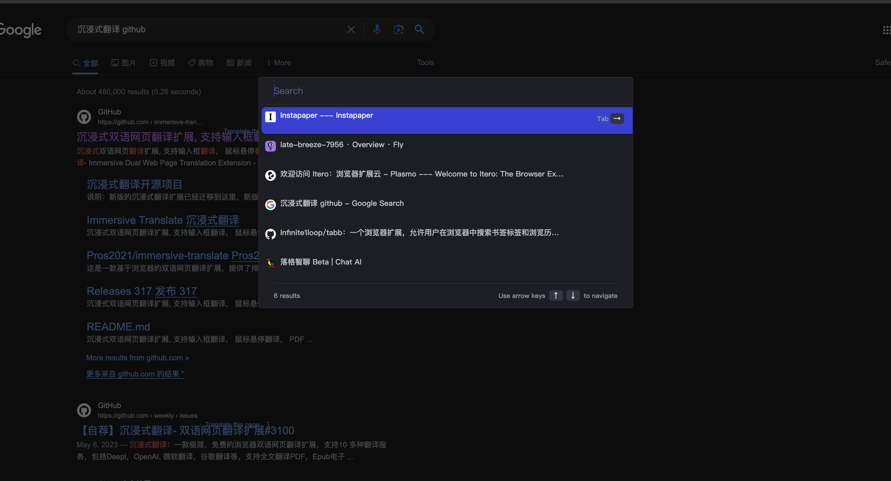

# tabb

#### 简介

浏览器内部的搜索只能根据 url/title 进行搜索, tabb可以根据页面的内容进行搜索,支持对 tab/bookmark/history 的内容进行搜索

效果如下:

#### 安装/使用

需要开启开发者模式, 然后加载 dist/chrome

安装之后, 直接点击图标 或者 Cmd+K (mac), Ctrl+K(other) 使用

Tabb: 一个可以深度搜索 Tab/Bookmark/History 的浏览器扩展工具 

可以搜索页面的内容, 之前看到有一个可以搜索Tab的工具, 经常会之前浏览或一个页面, 但是怎么也找不到,浏览器内部的工具只能搜索 url/title; 所以做了一个小工具,可以索引 url/title/content

欢迎尝试
项目地址: https://github.com/Infinite1loop/tabb 
